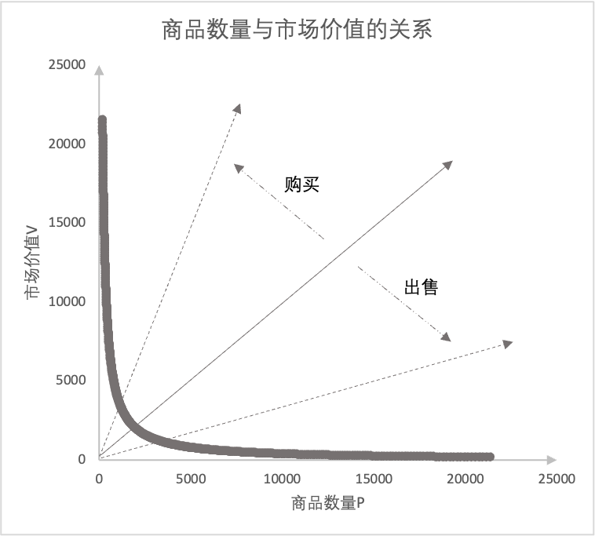
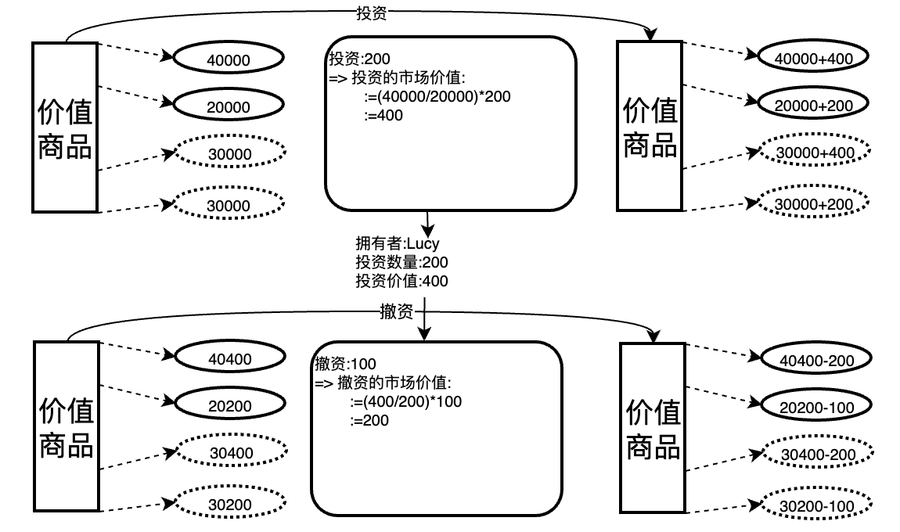
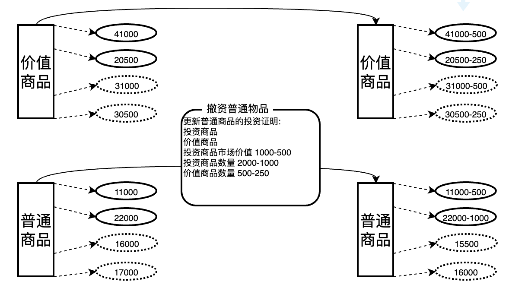
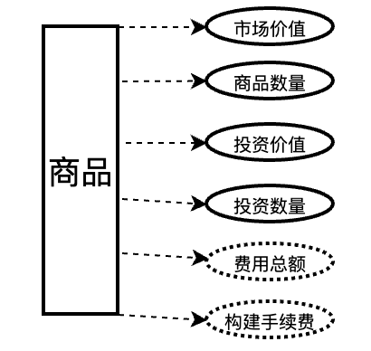
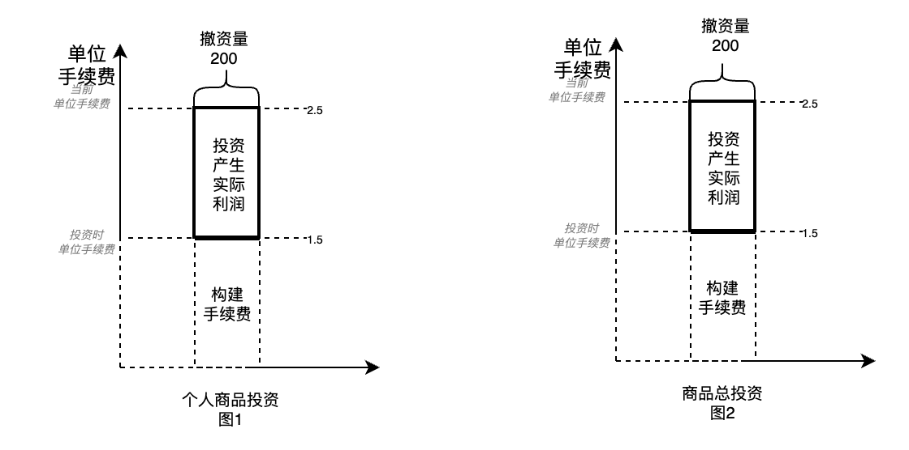
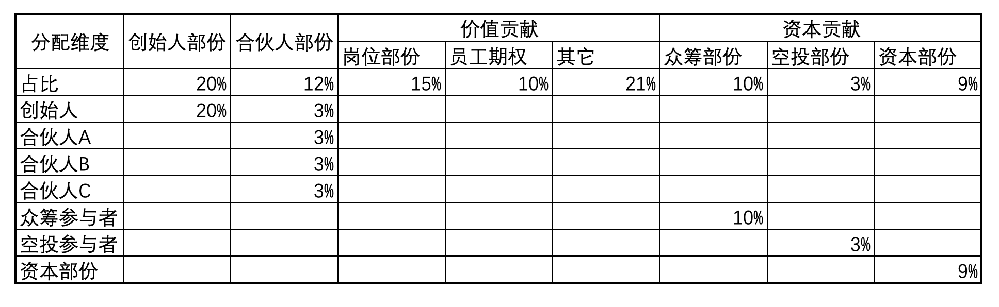

# 1 概要
TTSWAP(token-token swap)是建立在以太坊上的一套去中心自动做市协议.底层原理是根据用户行为触发的市场价值迁移为基础,以价值守恒交易策略进行的平台搭建.
白皮书解释了ttswap项目的设计逻辑.涵盖商品交易,价值商品投资与价值商品撤资,普通商品投资与普通商品撤资,和商品手续费产生与分配的原理和实现.

---
# 2 特点
1. 价值守恒交易策略  
通过价值守恒交易策略,能真实体现币种的真实市场价值,也能进行商品的快速交易.
2. 无中转,任意商品直接交易  
本平台任意两种物品可以直接交易,无须进行中间转换.
3. 无滑点,交易阈值内交易无滑点  
交易数量低于商品交易阈值,无滑点  
4. 没有无常损失,流动性提供者或商品投资者没有无常损失  
价值守恒交易策略从逻辑上就避免了无常损失,用户撤资时就能获得原投资商品+提供流动性产生的收益.
5. 低GAS费,计算逻辑简单,Gas比恒定乘积少60%-90%  
价值恒定交易模式逻辑简单,运算量少,GAS消耗低.
6. 手续费分角色返佣,人人参与  
手续费分角色分佣,任何人都可以成为平台中商品投资者(流动性提供者),商家,门户,推荐者,用户，平台角色,分享平台成长收益.
---
# 3 价值守恒交易模式原理
## 3.1 市场中的商品
例:在市场中有2000个商品A1,市场价值2000.

定义:
市场价值V(A1):用于衡量市场用户对于商品的需求程度.商品A的市场价值为2000
商品数量Q(A1):记录商品的数量.商品A的数量为2000.
单位价值P(A1):单位数量的市场价值.商品A的单位价值为1.
## 3.2 市场中的商品与用户买卖行为的关系
* 例1：用户花费价值1000购买,购买了商品A.

市场中商品A市场的需求增加.V(A1)=2000+1000=3000
市场中商品数量Q(A)减少.Q(A1)=2000-1000=1000
市场中商品的单位价值P(A)发生变化 P(A1)=3
* 例2：用户出售价值1000购买,购买了商品A.

市场中商品市场的需求减少.V(A2)=2000-1000=1000
市场中商品数量Q(A)增加.Q(A2)=2000+1000=3000
市场中商品的单位价值P(A)发生变化 P(A2)=0.3333

展示如下图

## 3.3 市场中用户行为与商品状态的关系
现在用户的出售与购买，商品的商场价值V与商品数量Q发生变化，商品的价格也发生相应变化,商品的市场价值V与商品数量Q的变化如图

## 3.4 市场中两种物品的关系
现在市场中有两种商品,A和B两种商品.A(2000,4000),B(4000,2000).
* 用户使用500商品A,对于的市场价值为1000.市场价值为1000对应的1000个商品B.   

当用户购买500个商品A,就要花费1000个商品B,平台中的商品在图中A位置会位移到A1的位置,B会位移到B1的位置.
当用户出售500个商品A,就能得到1000个商品B,平台中的商品在图中A位置会位移到A2的位置,B会位移到B2的位置.

因为位置发生变化,P(A)与P(B)也发生变化，商品B相对商品A的价格也会发生变化,如果与市场外部价格有差异,就会有其它交易促进市场价格与市场外部价格统一.
>备注：如果购买数量占市场中数据比例过大,会造成两商品的相对价格发生强烈波动,因此每个交易会拆分为多个小单进行交易
## 3.5 市场中多种商品的关系
任意两种商品因为用户交易,造成位置的变化,也会造成这两种商品与其它商品对对位置变化,产生价格的同步变化.

## 3.6 市场中商品每次交易大小与价格的关系
现场中商品数量为100 000 000 ,市场价值为100 000 000.
 | 交易大小 | 价格变化       |
 | -------- | -------------- |
 | 10       | 0.000000200000 |
 | 50       | 0.000001000000 |
 | 100      | 0.000002000002 |
 | 500      | 0.000010000050 |
 | 1000     | 0.000020000200 |
 | 5000     | 0.000100005000 |
 | 10000    | 0.000200020002 |
 | 50000    | 0.001000500250 |
 | 100000   | 0.002002002002 |
 | 500000   | 0.010050251256 |
 | 1000000  | 0.020202020202 |
 | 5000000  | 0.105263157895 |

## 3.7 无滑点阈值(别称交易阈值)
为避免用户交易造成平台商品被挤兑.每个商品在初始化时会设置切分数,每份大小即为这个商品的无滑点阈值,因此当用户交易时,如果交易价值小于商品无滑点阈值,无无常损失.如果交易大于商品无滑点阈值.交易会以阈值为单位,拆分成交.

---

# 4 商品
## 4.1 商品介绍
关于商品的描述:平台拥有市场价值3000的15枚A商品,那么商品就有两个属性:市场价值与商品数量.如下图

* 名词解释
市场价值:记录市场中商品的真实市场价值，用户购买商品，用户对于商品的需求度越高,平台中商品的市场价值越高。用户出售商品，用户对于商品的需求降低,商品的市场价值越低。
商品数量:记录市场中商品的当前数量。
- 可以如下图描述其它任何商品,例如

## 4.2 商品分类
| 商品分类 | 说明                                     | 交易是否 产生手续费 | 是否可以 单独投资自己 | 是否可以与其它价值商品 一同投资 |
| -------- | ---------------------------------------- | ----------------------- | ------------------------- | ----------------------------------- |
| 元商品   | 市场中添加的首个商品                     | 是                      | 是                        | 否                                  |
| 价值商品 | 商品得到市场认可, 有良好的生态及团队 | 是                      | 是                        | 否                                  |
| 普通商品 | 个人新增商品, 市场价值待确认         | 是                      | 否                        | 是                                  |
## 4.3 商品配置
- 商品配置占255位
### 4.3.1 市场可以调整
| id  | 配置项       | 位数 | 单位    | 最大值 | 最小值 | 起始位 | 结束位 | 说明 |
| --- | ------------ | ---- | ------- | ------ | ------ | ------ | ------ | ---- |
| 1   | 市场价值商品 | 1    | BOOLEAN | 1      | 0      | 256    | 256    |      |
| ... |
 
### 4.3.2 用户可以配置
| id  | 配置项     | 位数 | 单位     | 最大值 | 最小值 | 起始位 | 结束位 | 说明           |
| --- | ---------- | ---- | -------- | ------ | ------ | ------ | ------ | -------------- |
| 1   | 投资费率   | 10   | 万分之一 | 1023   | 0      | 255    | 246    | (1~1023)/10000 |
| 2   | 撤资费率   | 10   | 万分之一 | 1023   | 0      | 245    | 236    | (1~1023)/10000 |
| 3   | 购买费率   | 10   | 万分之一 | 1023   | 0      | 235    | 226    | (1~1023)/10000 |
| 4   | 出售费率   | 10   | 万分之一 | 1023   | 0      | 225    | 216    | (1~1023)/10000 |
| 5   | 交易切片数 | 10   | 64       | 1023   | 0      | 215    | 206    | (1~1023)X64    |
| 6   | 撤资切片数 | 10   | 64       | 1023   | 0      | 205    | 196    | (1~1023)       |

---

# 5 商品交换
商品的交换本质上是指用户使用商品A到市场中换取商品B,用户放弃商品A,证明市场中商品A的市场价值降低,用户才放弃.商品B市场价值在升高,用户才购买.

- 如图所示,因为用户使用(放弃)商品A,导致平台A商品数量增加,市场价值减少.而用户获得商品B,导致平台中商品B数量减少,市场价值增加.这样相对A相对B的价格就下降.再次交易,同样数量的商品A只能购买比上次少一些的数量B.

- 如图所示,也得到市场价值交易守恒的三大原则:
  1.用户购买时使用商品的市场价值等于用户得到商品的市场价值.
  2.用户购买前所有商品的市场价值汇总等于用户购买后所有商品的市场价值汇总.
  3.用户购买与出售,只会导致市场价值发生从一种商品转移到另一种商品,不会消失.

---

# 6 商品投资与撤资
## 6.1 记录投资和撤资
市场中商品的交易,需有人提供流动性.就应记录商品投资总市场价值与投资总数量.

* 名词解释
投资价值:记录用户投资时商品的市场价值汇总.
投资数量:记录用户投资时商品的数量的汇总.
## 6.2 价值商品投资与撤资流程

* 用户投资价值商品
  用户根据当前价值商品的状态,计算投资数量对应的市场价值.方便撤资时计算收益.
* 用户撤资价值商品
  用户根据投资记录,计算投资产生的收益
  撤资商品时,取消数量或者取消数量对应的市场价值需要小于商品当前的总数量或者总价值除以最大撤资比例.
## 6.3 普通商品投资

* 用户投资普通商品
  由于普通商品的市场价值波动太多,容易形成套取平台其它用户的代币.为避免这种情况的发生,需要投资等市场价值的价值商品.投资的价值商品和普通商品都会产生投资收益,具体参见手续费分配.
## 6.4 普通商品撤资

* 用户撤资普通商品
  根据投资记录,计算普通商品和投资商品的收益.具体参见手续费分配.
  撤资商品时,取消数量或者取消数量对应的市场价值需要小于商品当前的总数量或者总价值除以最大撤资比例.
---

# 7 商品手续费
## 7.1 商品手续费记录方式

* 名词解释
  费用总额为实际产生的手续费汇总+构建手续费汇总
  构建手续费为计算用户投资产生的利润而引入虚拟手续费,不实际发生的手续费.具体参见7.4与7.5.
## 7.2 手续费来源

手续费(实际手续费)的来源是根据商品的费率,当用户进行操作时,计算得到.
## 7.3 手续费分配

平台中涉及平台技术,门户运营,推荐人,用户以及流动性提供者.平台会合理分配利润.
其中流动性提供者的手续费分配参见 7.4与7.5手续费流程
* 如果用户填写了推荐者.
各角色分配分实时记录.
* 如果用户未填写推荐者.
用户所占比例划归于商家.
推荐者所占比例划归于门户.
___
## 7.4 手续费计算流程(投资)

* 图1
  单位手续费指单位投资应该得到多少手续费,单位手续费=手续费总额/总投资数量;
  随着交易的进行,手续费不断产生,手续费总额增加,单位手续费就增加.
  构建手续费提用户开始投资时,为记录用户不应该享受的手续费总额.
  构建手续费=投资数量X投资时单位手续费

* 图2
  当平台中不停有手续费产生时,单位手续费会不停增加.
  用户投资产生的收益=单位手续费x投资数量-构建手续费.

* 图3
  当用户在同一下商品上,进行多笔投资,可以合成同一条投资记录.
  合并后的构建手续费=合并前的构建手续费汇总
  手户投资产生的收益=单位手续费x投资数量-汇总后的构建手续费

* 图4 
  该图展示合并后的投资情况

* 图5
  当多个用户进行投资时,就可以汇总成这个商品总投资数量,总投资市场价值,总构建手续费.
  该商品当前总共实际投资利润=当前总费用-汇总构建手续费.

## 7.5 手续费计算流程(撤资)

* 图1
  当用户撤资时,获得利润= 单位手续费X撤资数量-构建手续费X(撤资数量/用户投资总量)
* 图2 
  在商品减去用户撤资时的利润和构建手续费.

---

# 8 市场配置
| id  | 配置项         | 位数 | 单位     | 最大值 | 最小值 | 起始位 | 结束位 | 说明 |
| --- | -------------- | ---- | -------- | ------ | ------ | ------ | ------ | ---- |
| 1   | 商品投资者分佣 | 6    | 百分之一 | 63     | 0      | 256    | 251    |      |
| 2   | 商家分佣       | 6    | 百分之一 | 63     | 0      | 250    | 245    |      |
| 3   | 门户分佣       | 6    | 百分之一 | 63     | 0      | 244    | 239    |      |
| 4   | 推荐者分佣     | 6    | 百分之一 | 63     | 0      | 238    | 233    |      |
| 5   | 用户分佣       | 6    | 百分之一 | 63     | 0      | 232    | 227    |      |
| 6   | 协议费率       | 6    | 百分之一 | 63     | 0      | 226    | 221    |      |
| ... |                |      |          |        |        |        |        |      |

---

# 9 主要代码实现(参见代码) 

# 9.1 合约部署GAS
| Deployment Cost | Deployment Size |
| --------------- | --------------- |
| 4877267         | 24752           |

# 9.2 合约函数(部份主要函数)GAS 
相对恒定乘积策略,价值守恒交易策略节约60%到90%的GAS费.

| Function Name        | min    | avg    | median | max    | 备注           |
| -------------------- | ------ | ------ | ------ | ------ | -------------- |
| buyGood              | 51373  | 138059 | 60565  | 329943 | 购买商品       |
| disinvestNormalGood  | 61544  | 128844 | 124744 | 204344 | 撤资普通商品   |
| disinvestNormalProof | 60921  | 128221 | 124121 | 203721 | 撤资普通证明   |
| disinvestValueGood   | 38356  | 73889  | 91656  | 91656  | 撤资价值商品   |
| disinvestValueProof  | 40516  | 92016  | 97816  | 126116 | 撤资价值证明   |
| initNormalGood       | 332431 | 359376 | 356331 | 405431 | 初始化普通商品 |
| investNormalGood     | 60628  | 122094 | 113028 | 192628 | 投资普通商品   |
| investValueGood      | 40648  | 116896 | 155177 | 279577 | 投资价值商品   |
| setMarketConfig      | 1125   | 1125   | 1125   | 1125   | 更新市场配置   |
| updateGoodConfig     | 3098   | 3098   | 3098   | 3098   | 更新商品配置   |

# 10 平台代币
  平台采用4C成长型社区代币建设方案.通过此方案,更加灵活促进平台成长.关于双代币模式会继续完善.
## 10.1 4C成长型社区代币治理建设方案
  4C成长型社区代币角色分为四类:创始人,合伙人,价值贡献,资本贡献.
  1. 创始人部份:
    创始人部份作为项目发起人提供大量的人力资本，用以开发产品、创立品牌、拓展市场、招募人才、建立管理制度，同时并承担了巨大的失败风险而享受的待遇，由创始人独持，享有控制权、决策权、分红权。(不因离职而强制回购,上线12个月后60个月逐季解锁。在末解锁时,由社区账户控制,拥有人也拥有这部份投票权与分红权)
  1. 合伙人角色(合伙人部份A类型和合伙人部份B类型):
    合伙人部份作为项目发起初期，在没有资源的情况下，需要充分利用自己团队的强大的执行力，去克服各种困难，一起坚持并坚信把社区做大做好做强的成员享受的待遇。由原始合伙人平均分摊，享有控制权、决策权、分红权。(合伙人部份A类型不因离职而强制回购, 合伙人部份B类型会因离职而强制回购,上线6个月后36个月逐季解锁.在末解锁时,由社区账户控制,拥有人也拥有这部份投票权与分红权)
  2. 价值贡献
    根据为社区建设提供的价值大小分配分红权.该部份的投票权由创始人拥有.岗位部份,员工期权部份和其它部份的调整根据情况调整.
     * 社区岗位部份:
     岗位部份由担承社区重要职位的重要程度而决定，这部分分给社区重要职位对应负责人，重要职位对应的比例由每年初的社区划定。社区对于重要职位的合格、优秀的负责人经过社区决策后可转一定比例为合伙人股份A类型和合伙人股份B类型。岗位部份分红权由负责人享有，控制权由社区账户控制,决策权由创始人享有。(离职时社区将回购该合伙人股份B类型，如社区未回购，合伙人股份B类型自动转为合伙人A类型。性质为岗位股份，离职时社区将收回该部份,社区锁定中)
     * 社区成员期权部份:
     激励员工为社区一起奋斗而预留部分。社区对于优秀员工经过社区决策后可转一定比例为合伙人股分B类型，控制权由社区账户控制,决策权由创始人享有，分红权由员工享有。(离职时社区将收回该部分,社区锁定中)
     * 其它部份:
    金库,运营,活动,顾问等用途使用.
  3. 资本贡献
     * 众筹部份(参见众筹方案):
      为团队建设,产品建设,流动性建设提供资金支持.
     * 投资部份:
      为团队精进,产品完善等提供资金支持.
     * 空投部份:
      为弥补平台早期用户风险.

过程中再有资本进入,通过增发来保证资本进入.同时社区也会通过回购或分红的方式使进利益共享.

## 10.2 4C成长型社区代币分配细则设计

注:
1.所有角色中未解锁部份由社区账户代持.
2.每季度末根据实际进行情况进行划转.
3.价值贡献部份对应人只拥有分红权,无控制权,无拥有权.根据团队完成目标情况,转化部份为合伙人部份-A类型或者合伙人部份B类型.
4.社区账户代持投权票归项目创始人控制.

## 10.3 TTS代币发行细则.
股份代币享有社区分红权,和资产所有权.
发行数量:10亿枚.

# 11 法律许可
## 11.1 说明
为了维护项目正常权利,同时也方便其它用户了解协议,对于不同文件不同开源协议.违反协议将得到法律追究.
## 11.2 协议说明
采用MIT协议的文件供大家自由使用
采用BUSL-1.1协议的文件才协议有效期内只能用户于学习目标,不能运用于商业用途,如违反条款,将面临巨额经济索赔.具体协议内容参见:项目中LICENSE文件或者
github:https://github.com/ttswap/ttswap-core/LICENSE.
如因项目在未知的情况违反其它项目开源协议,及时联系我们,我们尽快调整.

## 11.3 文件开源协议信息
├── GoodManage.sol(BUSL-1.1)  
├── MarketManager.sol(BUSL-1.1)  
├── ProofManage.sol(BUSL-1.1)  
├── interfaces  
│   ├── I_Good.sol(MIT)  
│   ├── I_MarketManage.sol(MIT)  
│   └── I_Proof.sol(MIT)   
├── libraries   
│   ├── Address.sol(MIT)     
│   ├── FullMath.sol(MIT)      
│   ├── L_Good.sol(BUSL-1.1)    
│   ├── L_GoodConfig.sol(MIT)     
│   ├── L_MarketConfig.sol(MIT)    
│   ├── L_Proof.sol(BUSL-1.1)    
│   ├── L_Ralate.sol(MIT)    
│   ├── Multicall.sol( GPL-2.0-or-later)     
│   ├── SafeCast.sol (MIT)     
│   └── Strings.sol (MIT)     
└── types   
    ├── S_GoodKey.sol(MIT)      
    ├── S_ProofKey.sol(MIT)     
    ├── T_BalanceUINT256.sol(MIT)     
    ├── T_Currency.sol(MIT)     
    ├── T_GoodId.sol(MIT)   
    └── T_ProofId.sol(MIT)     

# 11 参与和合作联系方式
X:@ttswap_exchange   
TG:@ttswap01   
Email:ttswap.exchange@gmail.com   
Discord:https://discord.com/invite/GZyEPZmk 
 