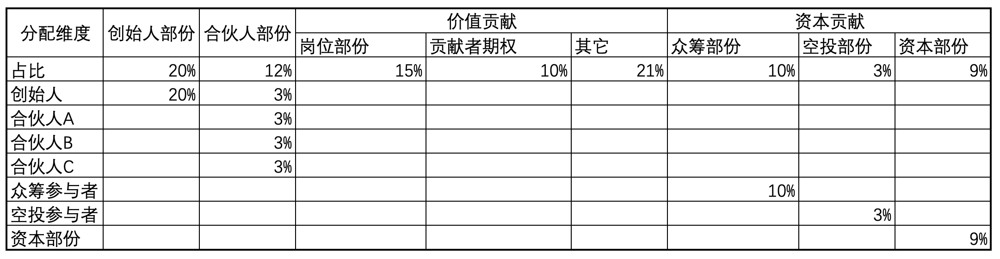

## 10.1 4C成长型社区代币治理建设方案
  4C成长型社区代币角色分为四类:创始人,合伙人,价值贡献,资本贡献.
  1. 创始人部份:
    创始人部份作为项目发起人提供大量的人力资本，用以开发产品、创立品牌、拓展市场、招募人才、建立管理制度，同时并承担了巨大的失败风险而享受的待遇，由创始人独持，享有控制权、决策权、分红权。(不因离职而强制回购,上线12个月后60个月逐季解锁。在末解锁时,由社区账户控制,拥有人也拥有这部份投票权与分红权)
  1. 合伙人角色(合伙人部份A类型和合伙人部份B类型):
    合伙人部份作为项目发起初期，在没有资源的情况下，需要充分利用自己团队的强大的执行力，去克服各种困难，一起坚持并坚信把社区做大做好做强的成员享受的待遇。由原始合伙人分摊，享有控制权、决策权、分红权。(合伙人部份A类型不因离职而强制回购, 合伙人部份B类型会因离职而强制回购.上线6个月后60个月内逐季解锁.在末解锁时,由社区账户控制,拥有人也拥有这部份投票权与分红权)
  2. 价值贡献
    根据为社区建设提供的价值大小分配分红权.该部份的投票权由创始人拥有.岗位部份,社区成员期权部份和其它部份的调整根据情况调整.
     * 社区岗位部份:
     岗位部份由担承社区重要职位的重要程度而决定，这部分分给社区重要职位对应负责人，重要职位对应的比例由每年初的社区划定。社区对于重要职位的合格、优秀的负责人经过社区决策后可转一定比例为合伙人股份A类型和合伙人股份B类型。岗位部份分红权由负责人享有，控制权由社区账户控制,决策权由创始人享有。(离职时社区将回购该合伙人股份B类型，如社区未回购，合伙人股份B类型自动转为合伙人A类型。性质为岗位股份，离职时社区将收回该部份,社区锁定中)
     * 社区成员期权部份:
     激励成员为社区一起成长而预留部分。社区对于优秀成员经过社区决策后可转一定比例为合伙人股分B类型，控制权由社区账户控制,决策权由创始人享有，分红权由成员享有。(离职时社区将收回该部分,社区锁定中)
     * 其它部份:
    金库,运营,活动,顾问等用途使用.
  3. 资本贡献
     * 众筹部份(参见众筹方案):
      为团队建设,产品建设,流动性建设提供资金支持.
     * 投资部份:
      为团队精进,产品完善等提供资金支持.
     * 空投部份:
      为弥补平台早期用户风险.

过程中再有资本进入,通过增发来保证资本进入.同时社区也会通过回购或分红的方式使进利益共享.

## 10.2 4C成长型社区代币分配细则设计

注:
1.所有角色中未解锁部份由社区账户代持.
2.每季度末根据实际进行情况进行划转.
3.价值贡献部份对应人只拥有分红权,无控制权,无拥有权.根据团队完成目标情况,转化部份为合伙人部份-A类型或者合伙人部份B类型.
4.社区账户代持投权票归项目创始人控制.

## 10.3 TTS代币发行细则.
股份代币享有社区分红权,和资产所有权.
发行数量:10亿枚.