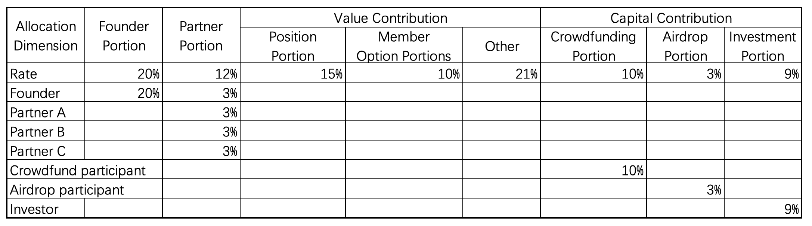

  The platform adopts a 4C growth-oriented community token construction scheme. Through this scheme, the platform's growth is more flexible and promoted. The dual-token model will continue to be refined.

## 10.1 4C Growth-Oriented Community Token Governance Development Plan
4C Growth Community Token Roles are divided into four categories: Founders, Partners, Value Contributors, and Capital Contributors.
1. Founder Portion:
The founder portion is held solely by the project initiator, who provides a significant amount of human capital to develop products, establish brand identity, expand the market, recruit talent, and establish management systems, while also bearing significant risks. Founders enjoy control, decision-making power, and profit-sharing rights. (Not subject to forced buyback upon resignation, 60-month quarterly unlocking after 12 months online. At the end of the unlocking period, controlled by the community account, and the owner also has voting and profit-sharing rights over this portion)
2. Partner Roles (Partner Portions A and Partner Portions B):
As initial project partners, they utilize their team's strong execution capabilities to overcome various challenges and believe in expanding and strengthening the community without resources. The original partners evenly distribute control, decision-making power, and profit-sharing rights. (Partner Portion A is not subject to forced buyback upon resignation, while Partner Portion B is subject to forced buyback upon resignation, with 36-month quarterly unlocking after 6 months online. At the end of the unlocking period, controlled by the community account, and the owner also has voting and profit-sharing rights over this portion)
3. Value Contribution:
Divides profit-sharing rights based on the value provided to the community. Voting rights for this portion are held by the founders. Adjustments to position portions, member options portions, and other portions are made according to circumstances.
* Community Position Portions:
The portion of positions is determined by the importance of positions in the community. This portion is allocated to individuals responsible for important community positions, and the proportion corresponding to important positions is determined by the community at the beginning of each year. After being qualified and excellent, individuals responsible for important positions can convert a certain proportion into Partner Portions A and Partner Portions B through community decisions. The profit-sharing rights of position portions are enjoyed by the responsible individuals, control is controlled by the community account, and decision-making power is held by the founders. (When resigning, the community will buy back the Partner Portion B, and if the community does not repurchase it, the Partner Portion B will automatically convert to Partner Portion A. It is a position share and will be recovered by the community upon resignation, and is locked by the community)
* Community Member Option Portions:
Reserved for incentivizing collaborators to do together for the community. After being qualified and excellent, outstanding member can convert a certain proportion into Partner Portion B through community decisions, control is controlled by the community account, decision-making power is held by the founders, and profit-sharing rights are enjoyed by member. (When resigning, the community will recover this portion, and it is locked by the community)
* Other Portions:
Used for treasury, operations, events, advisory, etc.
4. Capital Contribution:
* Crowdfunding Portion (See Crowdfunding Plan):
Provides financial support for team building, product development, and liquidity development.
* Airdrop Portion:
To compensate for early user risks on the platform.
* Investment Portion:
Provides financial support for team advancement, product improvement, etc.

Throughout the process, as more capital enters, it is ensured through issuance. Additionally, the community will also ensure profit sharing through buybacks or dividends.

## 10.2 Design of 4C Growth-Oriented Community Token Allocation Guidelines

Note:

1. The locked portion of all roles is held by the community account.
2. At the end of each quarter, transfers are made based on actual circumstances.
3. The value contribution portion is only entitled to dividend rights for the corresponding individuals, with no control or ownership rights. Depending on the team's achievement of goals, a portion may be converted into Partner-A or Partner-B shares.
4. Voting rights for holdings in the community account are controlled by the project founders.

## 10.3 TTS Token Issuance Guidelines.

The equity tokens enjoy community dividend rights and asset ownership.
Total issuance: 1 billion tokens.